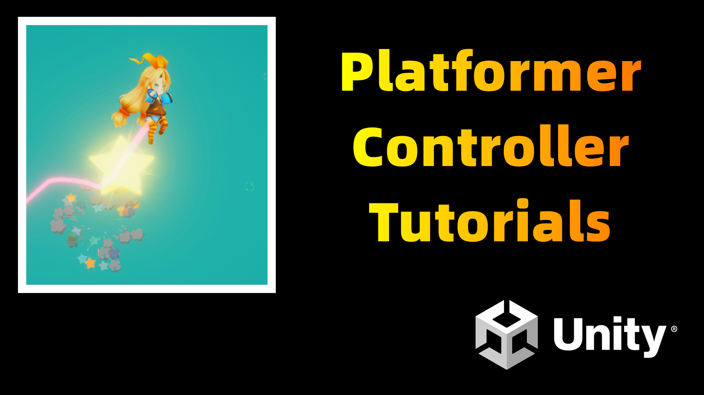

# Unity Platformer Controller Tutorial

## Tutorial Video List

- YouTube: <https://youtube.com/playlist?list=PLrn_k3ArwNC0Ujx60tRVChrVzSCYW1Rqf>
- Bilibili: <https://space.bilibili.com/27164588/channel/collectiondetail?sid=159578>

---

## Tutorial Contents

- Input System
- Finite State Machine
- Cinemachine
- Air Jump(Double Jump), Coyote Time, Variable Height Jump, etc.

---

Hello there, I am Ryan, an indie game developer and free-lance artist.

My channel is mainly involves about indie game dev tutorials and logs.

Welcome to subscribe, have fun :)

---

➤YouTube - <https://www.youtube.com/c/RYanIndieDev>

➤Discord - <https://discord.gg/ZmTgSCe4Jq>

➤Twitter - <https://twitter.com/XuZuyan>

➤FaceBook - <https://www.facebook.com/Yan.YouTube>

➤ArtStation - <https://www.artstation.com/xuzuyan>